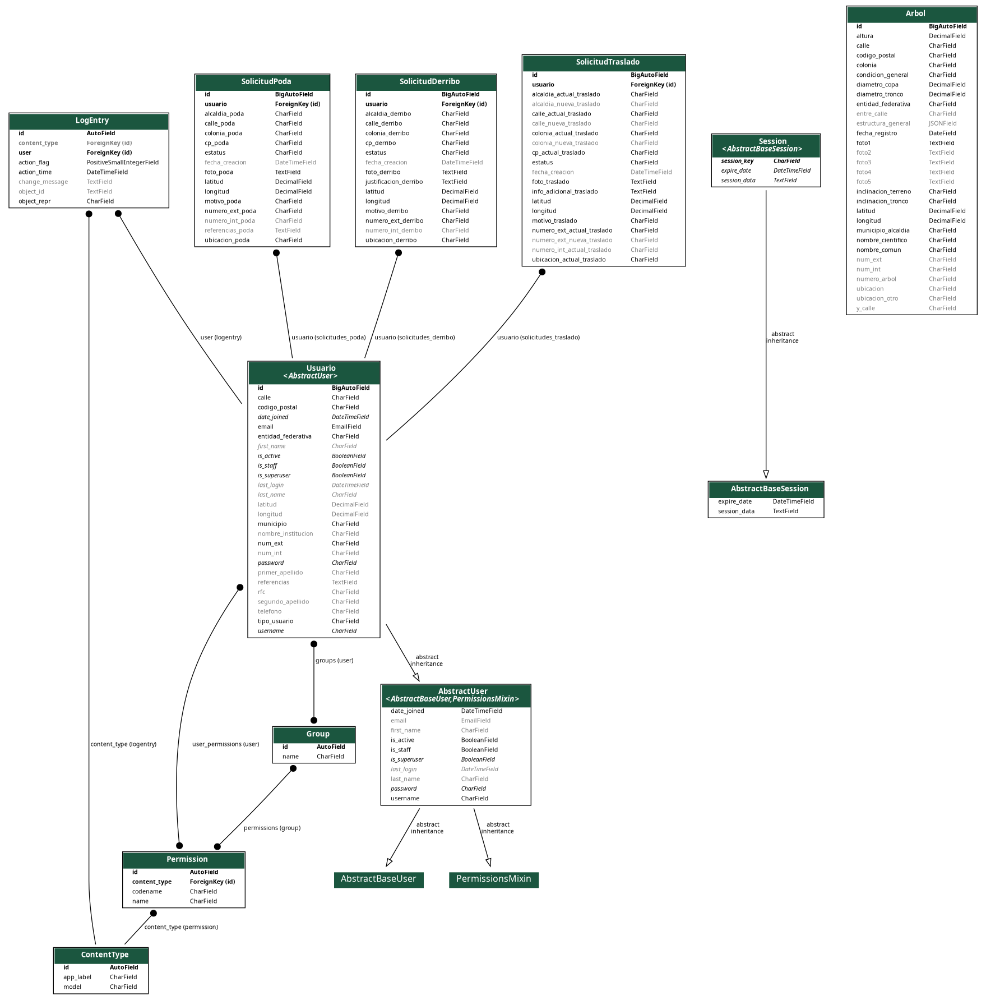

# 🌳 Urbanatura CDMX - Sistema de Gestión de Arbolado Urbano


**Sistema web para el inventario y gestión del arbolado urbano en la Ciudad de México**

🔗 **Sitio en producción:** [https://urbanatura-cdmx.fly.dev/](https://urbanatura-cdmx.fly.dev/)

---

## 📝 Descripción del Proyecto

**Urbanatura CDMX** es un sistema web desarrollado para la **gestión integral del arbolado urbano** en la Ciudad de México. Este proyecto se creó como parte de la materia **Bases de Datos** de la **Escuela Superior de Cómputo (ESCOM)** del Instituto Politécnico Nacional.

---

## 🌟 Características Principales

### Para Ciudadanos

* 📍 Registro de nuevos árboles con geolocalización.
* 📋 Solicitud de servicios (poda, derribo y trasplante).
* 🗺️ Visualización del inventario arbóreo en un mapa interactivo.
* 🔍 Seguimiento del estado de sus trámites.

### Para Instituciones

* 🏢 Gestión centralizada de todas las solicitudes.
* 📊 Panel de control con estadísticas clave.
* 📄 Generación de reportes descargables.
* 👥 Administración de usuarios y permisos.

---

## 🛠️ Stack Tecnológico

| Capa         | Tecnología                                                      |
| ------------ | --------------------------------------------------------------- |
| **Backend**  | Python (3.10 +), Django (4.2), PostgreSQL                       |
| **Frontend** | HTML5, CSS3, JavaScript, Tailwind CSS, Leaflet.js, Font Awesome |
| **DevOps**   | Fly.io, Git                                                     |

---

## 🗃️ Estructura de la Base de Datos



> **Nota:** Si clonas el proyecto y deseas generar o actualizar este diagrama, usa:
>
> ```bash
> # Dentro del entorno virtual
> python manage.py graph_models apps_arbol apps_poda apps_usuarios \
>   --group-models --dot -o docs/diagrama_bd.dot
>
> # Requiere Graphviz (paquete "graphviz")
> dot -Tpng docs/diagrama_bd.dot -o docs/diagrama_bd.png
> ```

El modelo relacional se organiza en las siguientes entidades principales:

1. **Usuarios** – Ciudadanos e Instituciones (hereda de `AbstractUser`).
2. **Árboles** – Registro detallado (especie, dimensiones, ubicación GPS).
3. **Solicitudes** – Poda, Derribo y Trasplante (cada una con su propio modelo).
4. **Ubicaciones** – Información geográfica (colonias, alcaldías, coordenadas).

---

## 🚀 Instalación Local

### 1. Requisitos previos

* Python 3.10 +
* PostgreSQL 13 +
* Git

### 2. Clonar el repositorio y preparar entorno

```bash
# Clonar
git clone https://github.com/IsmaelDatos/Urbanatura_CDMX.git
cd urbanatura-cdmx

# Crear y activar entorno virtual
python -m venv venv
source venv/bin/activate   # Linux / macOS
# En Windows PowerShell:
# .\venv\Scripts\Activate.ps1

# Instalar dependencias
pip install -r requirements.txt
```

### 3. Configurar la base de datos PostgreSQL

```bash
# Instalar PostgreSQL en Ubuntu/Debian
sudo apt update
sudo apt install postgresql postgresql-contrib

# Crear usuario y base de datos
sudo -u postgres psql <<'SQL'
CREATE DATABASE urbanatura_db;
CREATE USER urbanatura_user WITH PASSWORD 'TU_PASSWORD_SEGURO';
GRANT ALL PRIVILEGES ON DATABASE urbanatura_db TO urbanatura_user;
\q
SQL
```

### 4. Variables de entorno

```bash
cp .env.example .env
# Edita .env con tus credenciales DB, clave secreta, etc.
```

### 5. Migraciones y datos iniciales

```bash
# Aplicar migraciones\python manage.py migrate

# Crear superusuario
python manage.py createsuperuser

# (Opcional) Cargar datos de ejemplo
python manage.py loaddata datos_iniciales.json
```

### 6. Ejecutar servidor de desarrollo

```bash
python manage.py runserver
```

El sistema estará disponible en [http://localhost:8000](http://localhost:8000).

---

## 👥 Equipo de Desarrollo

| Nombre                         | Rol                           |
| ------------------------------ | ----------------------------- |
| **Ramírez Martínez Ismael**    | Desarrollo Frontend y Backend |
| **Feliz Elías Arzaluz Campos** | Diseño de Base de Datos       |

**Profesor:** Ulises Vélez Saldaña
**Semestre:** 3.º
**ESCOM – IPN**
